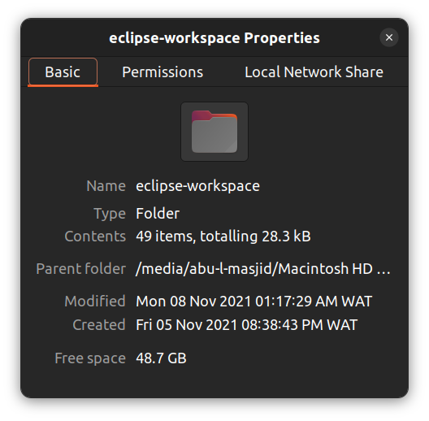

# Java Programming Codes Repository

This repository is an archive of beginner-level Java programs I developed as part of an introductory programming course during a university course (CSC301: Object Oriented Programming (OOP) in Java). It contains various simple projects and exercises written and executed in the **Eclipse IDE**. These codes cover essential Java programming concepts and serve as a foundation for learning object-oriented programming.
It is aimed at showcasing my fundamental Java skills and offering a resource for revisiting or demonstrating foundational programming concepts.
Created and completed between Fri, 5th Nov 2021 and Mon, 8th Nov 2021.

## Features

- **Topics Covered**:
  - Basic syntax and structure
  - Control structures (if-else, loops)
  - Classes and objects
  - Functions and methods
  - Basic data types and operations
  - File handling and input/output
- **Project Files**:
  - `.java` files (source code)
  - `.class` files (compiled output)

## Tools & Environment

- **IDE Used**: Eclipse IDE
- **Programming Language**: Java
- **Level**: Beginner

## Folder Structure

- **src**: Contains the source code files with `.java` extensions.
- **bin**: Contains compiled class files with `.class` extensions, generated by the Eclipse IDE.
- **images**: Screenshot file for reference.

## Screenshots

Here's a screenshots of the project folder properties:

## License

No license is applied to this repository as it is solely for educational and archival purposes.
